# This is Key!
*This is Key!* is designed to act as a learning and revision aid for school pupils. It is a hang-man-style game which provides key words from the pupils chosen topic within a chosen subject for the pupils to guess. The official definition taken from the exam governing body is provided as a hint to help the pupil use or build knowledge of the topic to identify the key word. 

Currently the game just demonstrates it's potential by offering keywords from a selection of Biology topics based on the WJEC GCSE syllabus. There is great scope for growth by expanding the subject options, topic options, governing body options, and also tailoring it to different age groups. 

This application is designed for use on a laptop or desktop but is responsive so displays as intended on hand-held devices. I envisaged this app being used on small laptops individual in classes, on a big screen with the whole class, or at home while revising or doing homework.

*Access link *

## User Stories

### First Time Visitor Goals
- As a first time user, I would like to understand how to use the application.
- As a first time user, I would like the navigation to be intuitive.
- As a first time user, I would like to be able to access the game instructions at any time. 

### Returning Visitor Goals
- As a returning user, I would like to be able to revisit the same topics to improve my score.
- As a returning user, I would like to have options of topics which I haven't chosen before.
- As a returning user, I would like to be provided with extra information about keywords to improve my understanding.

### Frequent Visitor Goals
- As a frequent user, I would like to recieve guidence on how to further improve my understanding of the subject.

## Features

### Landing Page
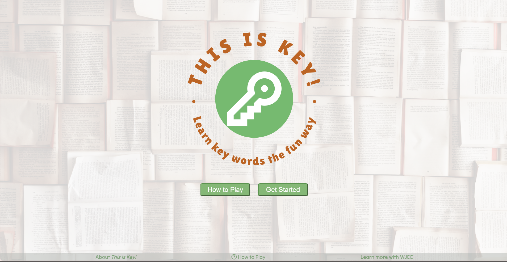
- [Small desktop Landing Page](documentation/readme_images/home_sm_desktop.png)
- [Tablet Landing Page](documentation/readme_images/tablet_landing.png)
- [Mobile desktop Landing Page](documentation/readme_images/mobile_landing.png)

The landing page is designed to be clean, eye catching, warm, inviting, and clearly explain the purpose of the app while expressing it's identity. This screen is important for the first time user goals as it offers clear instructions of how to play, explains the apps function and offers clear navigation through the app.

#### Logo 
The logo takes up most of the display to make it clear and easy for pupils to understand what the application is and what they can do with it. The green and warm colours are welcoming. There is a distictive and memorable icon so they remember the app. 

#### How to Play
The first button on this display is the 'How to Play' modal opener which explains how the user plays the game. The instructions are brief and simple so they can be easily understood. It is written in a child friendly way so it suits the target audience. It has an clear and obvious close button for easy navigation.

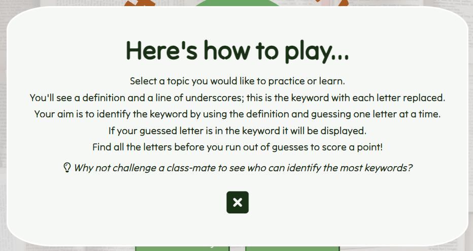

- [Large desktop 'How to Play' modal](documentation/readme_images/how_to_play_modal.png)
- [Small desktop 'How to Play' modal](documentation/readme_images/how_to_play_modal.png)
- [Tablet 'How to Play' modal](documentation/readme_images/how_to_play_modal.png)
- [Mobile desktop 'How to Play' modal](documentation/readme_images/how_to_play_modal.png)

#### Get Started
The second button on the landing page offers a clear route through the app to the the topic display. 

Both buttons have a gentle colour range on hover to improve asthetics, UX and the 'fun' element.

### Navbar

- [Navbar for small desktops](documentation/readme_images/!!!!!!!!!!)
- [Navbar for tablets](documentation/readme_images/!!!!!!!!!!)
- [Navbar for mobile](documentation/readme_images/mini_nav.png)

There are a couple of different navbar designs so that it can be responsive and still keep the main functionality. The larger navbar takes the extra width as an opprtunity to express the app's identity more clearly, while the smaller design keeps the essential navigation to the landing page and menu modal, while trying to maintain some identity. 

#### Logo
The logo is split into the icon, icon with phrase, and game title. This was necessary to ensure that the navbar is responsive but also retains key functionality. Different elements of the logo appear on the navbar depending on the screen-size, but in every case all logos, when clicked, will take the user to the landing screen.
- [Green key logo](../This_is_key/assets/images/green_key.png)
- [Icon and phrase](../This_is_key/assets/images/nav_logo.png)

#### Menu
The menu appears as a hamburger menu icon but when clicked is displayed as a modal. I chose to use modals as I think it improves UX when navigation is as simple as it is on this game. The user is never going to want the menu open while doing another activity on the app, so I made the menu options (and other modal information) take up the whole screen so they can see it easily.

- [menu modal large desktops](documentation/readme_images/main_menu_modal.png)
- [menu modal small desktops](documentation/readme_images/sm_desktop_menu_modal.png)
- [menu modal tablet](documentation/readme_images/ta)
- [menu modal mobile](documentation/readme_images/mo)

### Topics
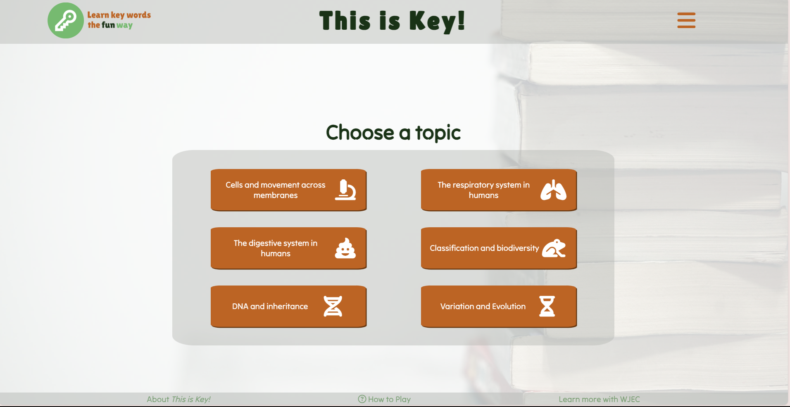
- [Topic display small desktops](documentation/readme_images/sm_desktop_topic_display.png)
- [Topic display tablet](documentation/readme_images/tablet_topic_display.png)
- [Topic display mobile](documentation/readme_images/mobile_topic_display.png)

The topic display is where the user is given the chance to choose which topic they would like their key words to be based on. When they select an topic they are automatically shown the game-play display so they don't have to think about navigation.

#### Topic Options
The topic options are displayed as radio buttons so that only one can be selected at a time. This means that when a user returns to the game it's easy for them to compare their scores for specific topics; as opposed to if they could choose all topics at once and score 80 points because of the accumulated key words from multiple topics.

The buttons are displayed in a container which allows the user to scroll through the topics if in the future the topic list were to expand. This was a decision made in order to improve responsiveness and meantainability. 

Each topic has a related icon which helps the user to quickly identify a topic. The icons also add to the sence of fun the app is trying to create. I added an  extra animation so that on hover the icons shake around to add to the fun. 

### Game Play

- [Game-play display on a small desktop](documentation/readme_images/mobile_topic_display.png)
- [Game-play display on tablet](documentation/readme_images/mobile_topic_display.png)
- [Game-play display on mobile](documentation/readme_images/mobile_topic_display.png)

This display has the most features and contains a lot of information for the user. The main purpose of this display is to show the key word the user is guessing and allow them to guess it. There are other features added to improve UX, as discussed below.

#### Current Score
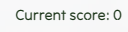

The current score is displayed in the top left corner as I felt this was an intuitive place to look for it. It clearly displays the current score which increases by one every time a word is guessed correctly. This is set back to zero on refreshing the page or opting to end the game. 

In addition to having the score increase when the user correctly guessed a word, I created a function that reduced the score if the user didn't guess all letters in time. I decided that this detracted from UX as it didn't make the user feel good if they were reducing their score more than increasing their score. I removed this function so that the words they did guess correctly could be tracked and celebrated. 

#### Current Topic

This feature was added later in the development of the game as I thought it would improve UX. In the top right hand corner of the game-play display the ID of the current topic is displayed. This helps the user to keep track of the topic, whereas it could be difficult to know which was selected if it wasn't there.

#### Changing Picture

![Video of the changing picture]!!!!!!

The changing picture indicates how many guesses the user has before they 'lose' the word. It counts down, displaying a full happy flower to start and ending with just a sad seed head if all guesses are used. 

The changing picture was almost removed from the game as it didn't link directly to the topics, and that felt like a design flaw to the game. I considered creating more images for each topic but decided this was too time consuming and would be a project for future improvement. I decided to keep the changing picture in the game anyway for a couple of reasons. Firstly, without the image indicating the number of guesses remaining, the display only contained data which is not very appealing to school aged users. Secondly, feedback from peers determined that the flower made the game more fun and made them want to keep playing. 

As this appeared to be such an important feature to make the game fun, I decided to improve the UX with it by animating it to spin on hover. I didn't want this to be an overwhelming animation to make sure the app is accessible so I think that by keeping it to an animation just on hover, it is subtle enough to meet this criteria. 

#### Keyword Definition

The definition given for the current keyword is taken directly from the WJEC syllabus. It is displayed as a hint so the user can use it to work out what the word is.

When the user either guesses the word correctly or doesn't guess the word, this definition is replaced by the 'win display' or 'lose display'. This prevents the user from thinking they can keep guessing letters, and again guides them on the correct path through game-play.  

#### Keyword (hidden)

When a new word is displayed, it is displayed as underscores, much like in a game of Hang-man. The number of underscores is determined by the number of letters. Special characters in the word are pre-displayed in the word as the user can only guess letters. This is referenced in the 'bugs' section. 

When the user guesses a correct letter, it is displayed in the correct place in the underscore word. When every letter is revealed, the user has won. 

#### Input Letter Field
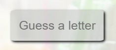
This is the field for inputting the letter guesses. I created a focus function so that the user didn't have to find the input field for their guess, improving UX. I also added a clear function so that the text they input clears automatically. Additionally, I created a 'keydown' event listener to detect the inputted letter so the user doesn't need to press enter or manually submit their guess, also improving UX. 

The input field has a placeholder explaining what the user has to do so that they can understand the game without reading the instructions as I expect my target audience wouldn't want to do.
See the [focused input letter field here](documentation/readme_images/!!!!!!!!!!!).

When the user successfully or unsuccessfully guesses the word, the input field is replaced with a 'next' button which guides the them on to the next phase of the game and also prevents more letters from being guessed.

#### Incorrectly Guessed Letters Box

The guessed letter box displays the letters that the user guesses but aren't in the word. This helps the user to keep track of the letters they have guessed. 

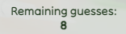
Below the guessed letters there's a feature that tracks the remaining guesses. This compliments the changing image in counting the user down so they know how many guesses remain. 

#### Win Display
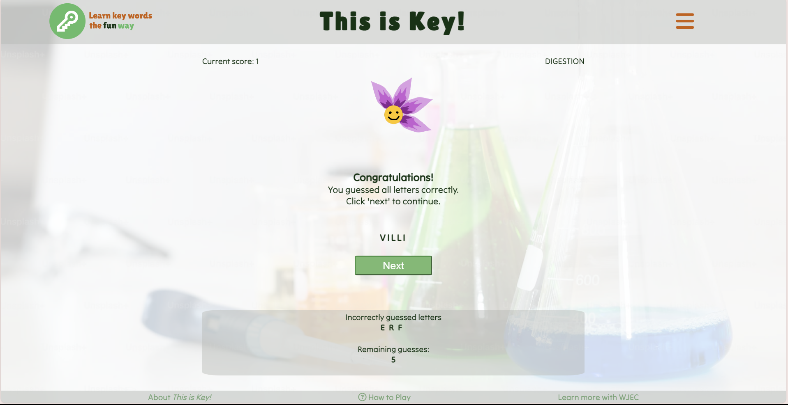

If the user guesses the word successfully, the description is replaced by a congratulations message. This shows the user they have been successful and explains what to do next. 

#### Lose Display
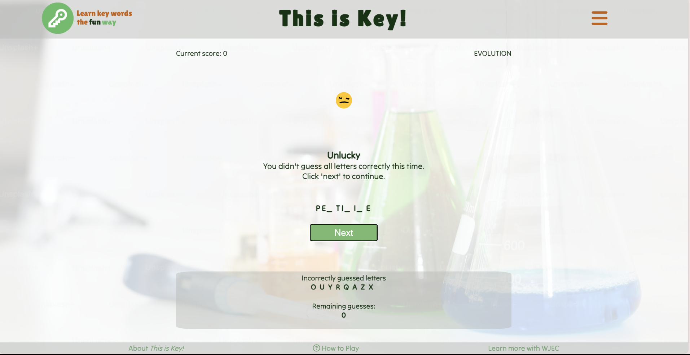

This feature has the same purpose as above but explains that the user was unsuccessful. 

### Word End Modal
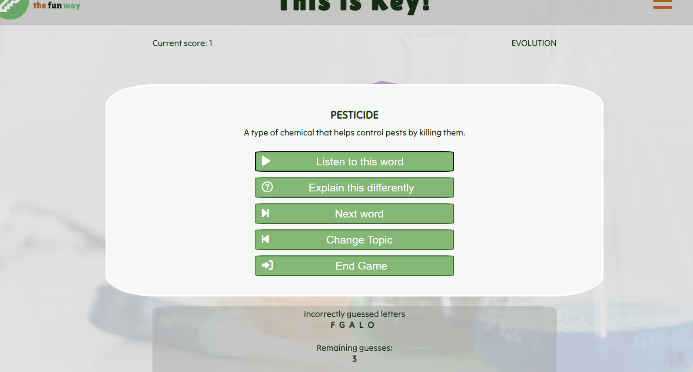
- [Word end modal small desktop](documentation/readme_images/sm_desktop_word_end.png)
- [Word end modal tablet](documentation/readme_images/tablet_word_end_modal.png)
- [Word end modal mobile](documentation/readme_images/mobile_word_end_modal.png)

The word end modal is reached when the user clicks 'next' on the win or lose display. This modal offers optional teaching points for the user as discussed below.   

#### Keyword
The keyword is displayed again incase they didn't correctly guess it. This also acts as a reminder of what the word was. 

#### Keyword Definition
The WJEC definition is also displayed again for review. The user may find that after identifying the word, it's useful to take some time to link it to the definition.

#### Keyword Audio
They are given the option to listen to the word. I hoped this would be beneficial for pupils who find reading challanging and also for those who are auditory learners. I thought it may make it more fun and memorable if there is the extra dimension of audio.

#### API Generated Dictionary Definition
Incase the user has trouble understanding the WJEC definition for the key word, I user a [Free Dictionary API](https://dictionaryapi.dev/) to provide an alternative definition. Sometimes it can help to have something explained slightly differently so I thought this could aid understanding. 

If this button is selected, it replaces the WJEC definition text. To ensure the user can return to the WJEC definition, the button is swapped out with one that replaces the dictionary definition with the WJEC definition.

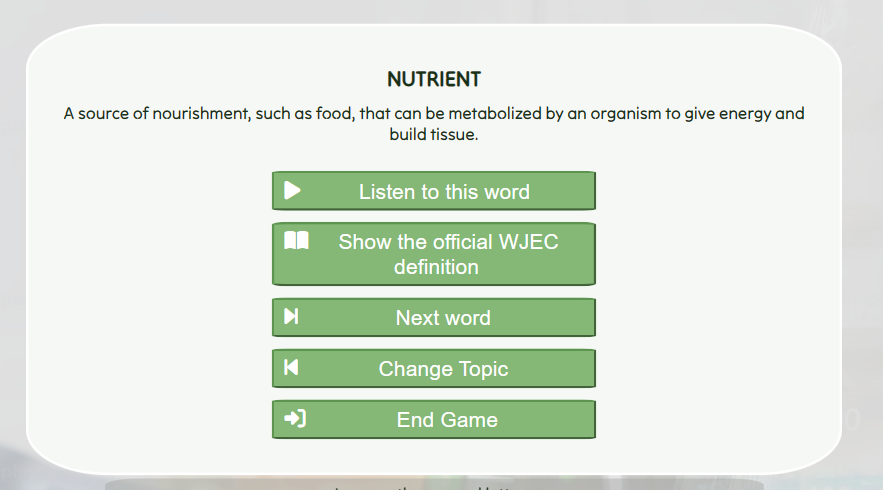

#### Next Word
This button takes the user back to the game-play display with a new word. The previous word is removed from the keyword array so it won't come up again.

#### Change Topic
The user can change topic at any time using the button in this modal or by visiting the main menu. 

#### End Game 
This takes the user to the end-game modal which explains the consequences of ending the game; all data will be reset including their score.

### Game End Modal Options
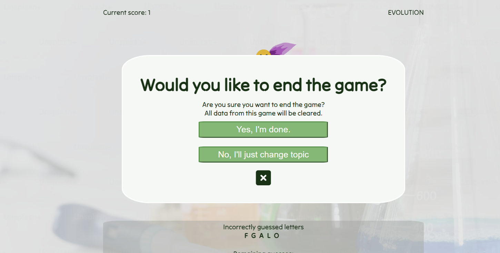

#### End Game
My selecting the button that says 'Yes, I'm done.', the user opts to end the game and all data will be reset as if the page had been refreshed. This is useful if they have used all words from the topic they are focusing on or if a new user is taking over. if selected, this takes the user back to the landing page.

#### Change Topic
The option to change topic is there incase the user didn't realise the consequences of ending the game and actually would like to continue but with a different set of key words. If selected, this takes the user back to the topic select display.

#### Close
A clear and intuitive close button allows the user to return the game-play display if they realise they don't like any of the options presented. The user can click 'next' again to revisit their options.

### Footer
I found it difficult to think of something  appropriate to display in the footer to begin with. The navigation throughout the game felt intuitive and I didn't want to take up space on the screen by duplicating it in the footer; I don't think social media links are appropriate for an educational game like this; the game doesn't have any contact details etc. that would be useful to the user. 

After revisiting the user story goals, I thought that futher learning suggestions would be hugely beneficial to the user and allow them to take their knew knowledge further and apply it else where. Additionally, I though a first time user could benefit from knowling more about the purpose of the game or other details about origin of data. Finally, I included navigation to the rules incase the user wants to revisit them without loosing their progress in the game. 

#### About *This is Key!*
This is Key may seem, without context, like a hang-man style game with random words and definitions. This means it can be used by anyone which is good but I also want the target audience to know that it is for them. I explain the target audience in the about section and also mentioned that the keywords and definitions are taken from the WJEC syllabus directly so they know that this is exactly what they need to know for their classes. 

#### How to Play
I included a navigation link to the 'how to play' modal so that it can be accessed at any point during use of the app. I was aware that users may skip the option to start with and may want to see the instructions after they had left the landing page. If they did leave the game-play page they would lose the data for their current word. This option removes the risk of this happening.

#### WJEC Link
I decided that it would be beneficial for the user to have the option and suggestion of other learning and revision materials for the topics they are studying. I found a resource by WJEC which links with the keyword theme of this game and allows the user to apply their new knowledge, taken from this game and apply it else where.

## Technologies Used
*Create link for each and desciption of use*
- HTML
- CSS
- JavaScript
- CSS Flexbox
- Figma
- VSCode
- Git
- GitHub
- Jest

## Logic Flowchart 
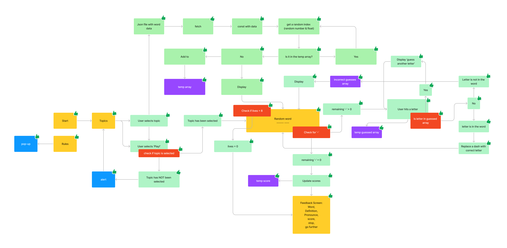
I created a flow diagram to get my head around the logic of the app I wanted to create. I found this a key tool to organise my work and identify what still needed to be done. When I had completed anything of the flow diagram, I added a 'thumps up' so I knew it had been completed. 

## Wireframes 
I used [figma](https://www.figma.com/) to create wireframes for this project. This helped my to visualise the end product so I had a clear idea of what I was working toward throughout the development stages. 

### Landing Page
- [Landing page large desktop](documentation/readme_images/wireframe_lg_desktop_home.png)
- [Landing page large desktop](documentation/readme_images/wireframe_sm_desktop_home.png)
- [Landing page large desktop](documentation/readme_images/wireframe_tablet_home.png)
- [Landing page large desktop](documentation/readme_images/wireframe_mobile_home.png)

### How to Play
- [Landing page large desktop](documentation/readme_images/wireframe_lg_desktop_rules.png)
- [Landing page large desktop](documentation/readme_images/wireframe_sm_desktop_rules.png)
- [Landing page large desktop](documentation/readme_images/wireframe_tablet_rules.png)
- [Landing page large desktop](documentation/readme_images/wireframemobile_rules.png)

### Topic Selection
- [Landing page large desktop](documentation/readme_images/wireframe_lg_desktop_topics.png)
- [Landing page large desktop](documentation/readme_images/wireframe_sm_desktop_topics.png)
- [Landing page large desktop](documentation/readme_images/wireframe_tablet_topics.png)
- [Landing page large desktop](documentation/readme_images/wireframemobile_topics.png)

### Game-play display
- [Landing page large desktop](documentation/readme_images/wireframe_lg_desktop_game.png)
- [Landing page large desktop](documentation/readme_images/wireframe_sm_desktop_game.png)
- [Landing page large desktop](documentation/readme_images/wireframe_tablet_game.png)
- [Landing page large desktop](documentation/readme_images/wireframe_mobile_game.png)

## Design Choices

### Colours

I used [coolors](https://coolors.co/276fbf-3d3b30-f0a202-7fb800-bcd8c1) to create a colour pallet for this game. I chose colours which are typically considered gender neutral so that it would be appealing to any pupil, regardless of gender. I also aimed for colours which were bright and positive so to keep the user's attention and to keep them motivated. If they are feeling positive and happy when using the application, I believe they are more likely to learn and retain keyword information. I have also chosen colours that will contrast well and be clear for anyone to see, even if visualy 

- #### OE3312
    I used this dark green colour for text that I needed to be very visible. For example, It was used for instructions and keyword information. I chose a dark green Instead of black as I thought it was a bit softer but still contrasted nicely. 

- #### B5B9B4
    This light grey colour was used for containers. For example, the guessed letter container and the topic select container. I felt this was a visually appealing way to group elements without it standing out and detracting from the content. It also softened the harsh white and dark green that I used throughout for contrast.

- #### 76BA70
    This light green colour is one of the main colours of the apps identity. I chose green as it has connotations of positivity and reward, and it's also a fairly natural and neutral colour that brightens up the page. 

- #### FFFFFF
    I wouldn't usually chose a straight white colour but i felt the site was looking a bit dark and wanted it to feel bright and fresh, with the aim of limiting distractions and maintaining concentration. I also felt that this contrasted nicely with the other colours for accessibility. 

- #### C95E00
    This orange colour was selected becuase it is a little less bold and garish than a brighter orange so sits nicely with the other slightly muted colours. It also is bright and has warm, happy connotations which I think will make the user feel welcome when visiting the site. I also think it's contrast with the green suggest that the site will be fun. It's important that this isn't portrayed as a serious and boring app, as it won't be successful with the target audience in that case. 

### Fonts
It is essential that the chosen fonts help to improve accessibility for the site as I know there is a high prevalence of dyslexia and learning disabilities in schools. I would like pupils with these extra challenges to benefit from this application. Additionally, I have chosen fonts that are soft and a little bit querky to make the app seem more fun. 

- #### Lilita One

I chose Lilita One for the main heading and identity of the site. It is used in the logo exclusively as I felt it is less readable than Tilt Neon but represented the site nicely. It is bold, clear and feels playful. 

- #### Tilt Neon

After doing a bit of research into fonts which are most accessible to people with dyslexia, I found that comic sans was listed amoung other clear fonts. I didn't feel any of the fonts mentioned represented this project very wel but found that Tilt Neon does and is very similar, in terms of letter shape and spacing, to comic sans. This seemed like a good balance of fun character and clear, readable quality. I was concerned that using a traditional font would make the pupils feel like they are reading a book or wikipedia which is the opposite approach to learning than this game. 

### Animations
I wanted to include some animations and on-hover effects to make the game more user friendly and fun. To achieve this I added animations to icons on the topic select page, and to the changing image on the game-play display. 

I also made sure to add hover effects to all items that were interactive so that it was clear that they can be clicked and used. For example, all buttons transform to a different colour on hover; the nav elements change colour and grow; elements in the footer darken and become easier to read. I felt these adjustments improved UX.

## Bugs

### Resolves Bugs

- #### updateWordProgress() function
    The 'updateWordProgress()' function wasn't working for a long period. Initially I was using advanced JavaScript to replace unguessed letters with underscores but found that when this wasn't working it was too difficult to identify the problem with tests. I replaced the advancedJavascript as seen in the first image:
    
    Instead I wrote this function using a 'for' loop and identifying if the guessed letter matched the letter in this position in the keyword. This is shown in this image:
    

- #### checkLetter() funcion
    checkLetter() stopped preventing the user from submitting multiple letters at once or numbers. To resolve this bug, I first used 'console.log()' to identify where the problem was and then changed individual sections of the code and tested it each time to see if the changes were affective. The solution in the end was to correct the 'if' statement for 'guessValid'.
    The first images shows the user of 'numberOfCharacters' and 'validGuess === true'.
    
    The second image shows that when replacing this 'validGuess !== -1', it disallows double character guesses as well and it identified letter characters more affectively as well. This meant I could remove the 'numberOfCharacters' 'if' statement.
    

- #### Keywords containing spaces can't be completed
    If the keyword contains a space or dash, the user is unable to correctly guess the whole word (they can only guess letters, not special characters). See this bug below:
    
    I initially added spaces to the 'possibleLetters' array, but for better UX these shouldn't appear as underscores to begin with. I found that a solution to this was to add a couple of lines to the 'if statement'  in the updateWordProgress function. The addition is displayed below and highlighted. 
    

- #### Minus scores displayed 
    If the user has more 'losses' than 'wins', the 'Current Score:' displays negative numbers. This is evidenced below.
    
    This doesn't create a good experience for the user so I wanted to make sure the score could not go lower than '0'. To resolve this bug I added an 'if statement' to the removePoint() function. See below.
    

- #### Duplicated 'newWord' function
    When the user clicks on the menu, in the top right, and selects 'new word', the new word function is called as it should be and nothing apears to be wrong. But when I displayed the keywordIndexOptions in the console, which should have one removed every time 'newWord' is called, I could see that two words were removed every time. This meant that the function was being called twice, though it wasn't immediately obvious where. I found that I had an event listener in my script.js and my game.js file which called the newGame function. As mentioned this, wasn't immediately obvious as the event listener in the script.js file called the function 'showGamePlay' which called in 'newWord' function inside it. 
    To resolve this bug, I removed the event listener in game.js, as the job of this event listener was already being completed by the script.js event listener.

- #### API doesn't provide definition for all words
    When the API is used and a definition for the specific keyword is fetched, an error sometimes returned if the keyword word was actually multiple words and hence not recognised as a word. Alongside this, I found that words with multiple meanings provided the incorrect definition. To resolve this I created an array of keywords which didn't provide definitions as expected and replaced the HTML of the 'dictionary-definition' button to explain that there isn't a keyword available. 
    Though this was long-winded and time-consuming, I think it's important to go through every word and definition and screen the data to ensure it is suitable for school aged children. 
    

- #### Delay on topic select
    When a topic is selected the function to showGamePlay is run straight away. This means that as the button is clicked, the function which checks keyword array length is called as well. Fetching the data is slower than the time it takes to check the keyword array so sometimes returned an error saying there were no words in that topic, when there were fractions of a second later. This meant the user was presented with an alert saying there were no words available which is very bad UX. 

    I resolved this bug by changing the getData(Json) function to an async function and added the showGamePlay callback at the end of this function. This was when the data has finished loading, the next page is automatically displayed. 
    

### Unresolves Bugs

- #### querySelectorAll not working with showModal method.
    I found that when I used dialog modals and added event listeners to more than one element by using 'querySelectorAll' or 'getElementByClass', an error came up saying that '.addEventListener is not a function'. This is because an array was returned when getting multiple elements. To overcome this issue I itterated through the returned array and added an event listener within the for loop. This was successful when adding an event listener to display the home screen, for example, but the exact same method returned the original error when trying to apply it to the modals. 
    I was unable to resolve this bug to the extent I would have liked, but to allow the game to continue functioning, I added event listeners onto the ID of multiple elements. This is something I intend to look into and resolve when I am not working to a deadline. 

- #### On-screen keyboard on mobile devices

## Testing

### Compatibility
Compatability Table
- #### Chrome
- #### Safari
- #### Edge
- #### Firefox

### Responsiveness
Could include videos here 
- #### Phone
- #### Tablet
- #### Desktop

### Validator Testing
- #### HTML with W3C
- #### CSS with W3C
- #### JS with JSHint?

### Accessibility and Performance
Lighthouse 

## Deployment 
Githube pages. Explain how it was deployed.

## Local Deployment
How to make a local copy by cloning

## Credits

- ### Content
    - Keywords and WJEC definitions were originally taken from [BBC Bitesize's website](https://www.bbc.co.uk/bitesize/guides/zsgfv4j/revision/1) which provides a glossary for each topic. However, midway through the project the website was updated and the glossary data was removed. Instead, I got the same data from my partner who had it provided by [pmt.education](https://www.pmt.education/?utm_source=resources&utm_medium=referral&utm_campaign=pdf&utm_content=copyright_notice) as a resource for teaching in school. 
    - I used [Free Dictionary API](https://dictionaryapi.dev/) to provide an alternative definition to aid understanding.
    - Inspiration for the project came from my partner who teaches biology in secondary school and is always looking for quick educational activities for the pupils at the start of each lesson.

- ### Media
    - #### Flower animation
        - I created the flower animation using the art package [Krita](https://krita.org/).
        - I removed the background using [removebg](https://www.remove.bg/).

    - #### All background images were taken from [unsplash](https://unsplash.com/)
        - [Home display background](https://images.unsplash.com/photo-1457369804613-52c61a468e7d?ixlib=rb-4.0.3&ixid=M3wxMjA3fDB8MHxwaG90by1wYWdlfHx8fGVufDB8fHx8fA%3D%3D&auto=format&fit=crop&w=1770&q=80)
        - [Topic display background](https://images.unsplash.com/photo-1516979187457-637abb4f9353?ixlib=rb-4.0.3&ixid=M3wxMjA3fDB8MHxwaG90by1wYWdlfHx8fGVufDB8fHx8fA==&auto=format&fit=crop&w=1770&q=80)
        - [Game display background](https://plus.unsplash.com/premium_photo-1661430659143-ffbb5ce2b6a7?ixlib=rb-4.0.3&ixid=M3wxMjA3fDB8MHxwaG90by1wYWdlfHx8fGVufDB8fHx8fA%3D%3D&auto=format&fit=crop&w=1932&q=80)    

## Acknowledgements

## Future Improvements 

- ### Potential Scope
    I aimed to create an application that has scope to grow and become more accessible to different age groups, pupils studying using different examining bodies, and different subjects. As it is currently, the project targets GCSE aged pupils studying Biology in Wales under the WJEC exam governing body.This is a very small target audience but was used to demonstrate the potential of the app in the given time frame. 

- ### Future Features 

    - #### Local leaderboard
        I would like to introduce a feature which allows the user to save their score to a leaderboard. The leaderboard would be only for 'invited' users or those in a designated 'room', with the idea being that the 'room' could contain pupils from a class. This would then allow them to share their scores with their classmates or let their teacher track their progress as they work their way throug hthe syllabus. 

    - #### Subject selection
        As mentioned in the 'Potential Scope' section, I would like this app to be expanded to include more subjects. It currently just targets Biology. The aim would be to eventualy expand the subject options to make it available to as many subjects as are suitable.

    - #### Exam body selection
        Similarly to above, I would like to widen the offering of this app to allow pupils using AQA or Edexcel, for example, for their studies. 

    - #### Increase topic offering
        The ap currently offers 6 topics in the subject of Biology, but the GCSE syllabus actually has around 20 topics which the pupils will learn in school. Due to time constraints, I didn't include all of those in this version but a future improvement would be to add the rest of the topics. 
    
    - #### Picture relevant to topic

