# This is Key!
*Desciption of app*

*Access link *

## User Stories

### First Time Visitor Goals
-
-

### Returning Visitor Goals
-
-

### Frequent Visitor Goals
-
-

## Features

### Landing Page
- Rules
- Play Game

### Topics
- Select topic from subject of biology

### Game Play
- word definition
- Input letter field
- Incorrect guessed letters display
- Correct letters/word display
- Current score display 
<!-- - Picture which changes with each guess (EXTRA FEAT.) -->

### End of Game Display
- Correct word displayed
- Definition of word
- API generated pronounciation of word/ dictionary definition
- 'ok' button

### End of Game Options
- Next word button
- Change topic button
- Finished button

## Technologies Used
*Create link for each and desciption of use*
- HTML
- CSS
- JavaScript
- CSS Flexbox
- Figma
- VSCode
- Git
- GitHub

## Logic Flowchart 

## Wireframes 

## Design Choices

### Colours
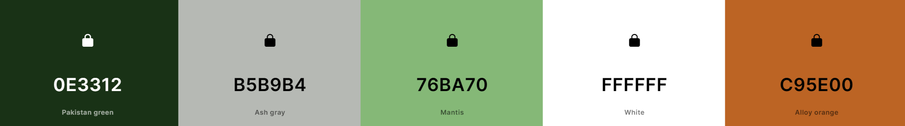
I used [coolors](https://coolors.co/276fbf-3d3b30-f0a202-7fb800-bcd8c1) to create a colour pallet for this game. I chose colours which are typically considered gender neutral so that it would be appealing to any pupil, regardless of gender. I also aimed for colours which were bright and positive so to keep the user's attention and to keep them motivated. If they are feeling positive and happy when using the application, I believe they are more likely to learn and retain keyword information. I have also chosen colours that will contrast well and be clear for anyone to see, even if visualy 

- #### OE3312
    I used this dark green colour for text that I needed to be very visible. For example, It was used for instructions and keyword information. I chose a dark green Instead of black as I thought it was a bit softer but still contrasted nicely. 

- #### B5B9B4
    This light grey colour was used for containers. For example, the guessed letter container and the topic select container. I felt this was a visually appealing way to group elements without it standing out and detracting from the content. It also softened the harsh white and dark green that I used throughout for contrast.

- #### 76BA70
    This light green colour is one of the main colours of the apps identity. I chose green as it has connotations of positivity and reward, and it's also a fairly natural and neutral colour that brightens up the page. 

- #### FFFFFF
    I wouldn't usually chose a straight white colour but i felt the site was looking a bit dark and wanted it to feel bright and fresh, with the aim of limiting distractions and maintaining concentration. I also felt that this contrasted nicely with the other colours for accessibility. 

- #### C95E00
    This orange colour was selected becuase it is a little less bold and garish than a brighter orange so sits nicely with the other slightly muted colours. It also is bright and has warm, happy connotations which I think will make the user feel welcome when visiting the site. I also think it's contrast with the green suggest that the site will be fun. It's important that this isn't portrayed as a serious and boring app, as it won't be successful with the target audience in that case. 

### Fonts
It is essential that the chosen fonts help to improve accessibility for the site as I know there is a high prevalence of dyslexia and learning disabilities in schools. I would like pupils with these extra challenges to benefit from this application. Additionally, I have chosen fonts that are soft and a little bit querky to make the app seem more fun. 

- #### Lilita One

I chose Lilita One for the main heading and identity of the site. It is used in the logo exclusively as I felt it is less readable than Tilt Neon but represented the site nicely. It is bold, clear and feels playful. 

- #### Tilt Neon

After doing a bit of research into fonts which are most accessible to people with dyslexia, I found that comic sans was listed amoung other clear fonts. I didn't feel any of the fonts mentioned represented this project very wel but found that Tilt Neon does and is very similar, in terms of letter shape and spacing, to comic sans. This seemed like a good balance of fun character and clear, readable quality. I was concerned that using a traditional font would make the pupils feel like they are reading a book or wikipedia which is the opposite approach to learning than this game. 

## Bugs

### Resolves Bugs

- #### updateWordProgress() function
    The 'updateWordProgress()' function wasn't working for a long period. Initially I was using advanced JavaScript to replace unguessed letters with underscores but found that when this wasn't working it was too difficult to identify the problem with tests. I replaced the advancedJavascript as seen in the first image:
    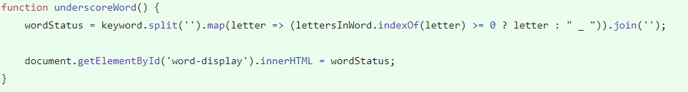
    Instead I wrote this function using a 'for' loop and identifying if the guessed letter matched the letter in this position in the keyword. This is shown in this image:
    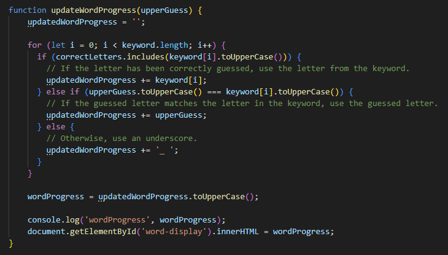

- #### checLetter() funcion
    checkLetter() stopped preventing the user from submitting multiple letters at once or numbers. To resolve this bug, I first used 'console.log()' to identify where the problem was and then changed individual sections of the code and tested it each time to see if the changes were affective. The solution in the end was to correct the 'if' statement for 'guessValid'.
    The first images shows the user of 'numberOfCharacters' and 'validGuess === true'.
    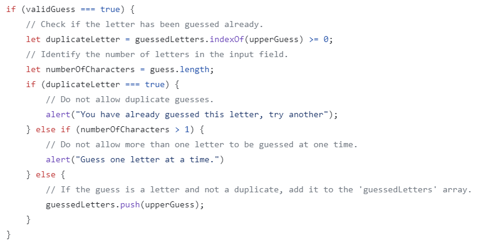
    The second image shows that when replacing this 'validGuess !== -1', it disallows double character guesses as well and it identified letter characters more affectively as well. This meant I could remove the 'numberOfCharacters' 'if' statement.
    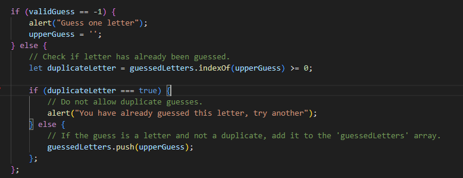

- #### Keywords containing spaces can't be completed
    If the keyword contains a space or dash, the user is unable to correctly guess the whole word (they can only guess letters, not special characters). See this bug below:
    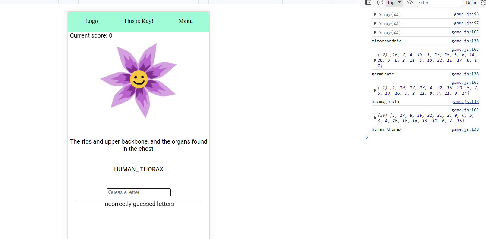
    I initially added spaces to the 'possibleLetters' array, but for better UX these shouldn't appear as underscores to begin with. I found that a solution to this was to add a couple of lines to the 'if statement'  in the updateWordProgress function. The addition is displayed below and highlighted. 
    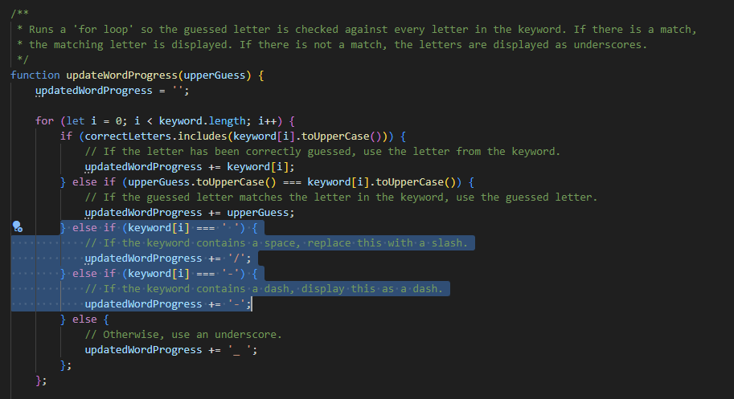

- #### Minus scores displayed 
    If the user has more 'losses' than 'wins', the 'Current Score:' displays negative numbers. This is evidenced below.
    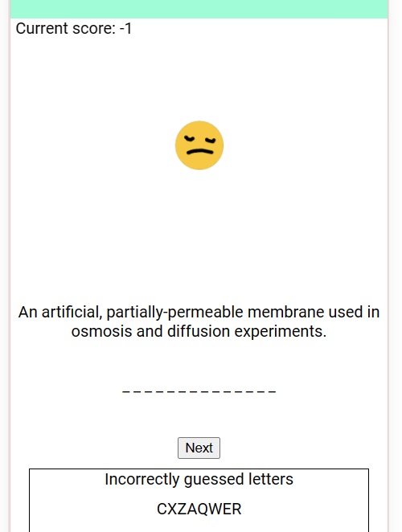
    This doesn't create a good experience for the user so I wanted to make sure the score could not go lower than '0'. To resolve this bug I added an 'if statement' to the removePoint() function. See below.
    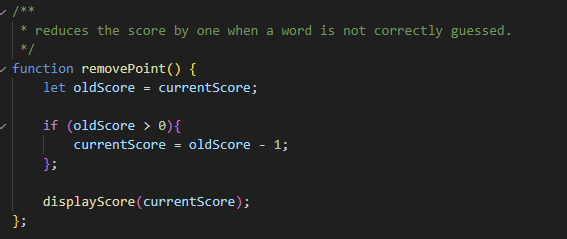

- #### Duplicated 'newWord' function
    When the user clicks on the menu, in the top right, and selects 'new word', the new word function is called as it should be and nothing apears to be wrong. But when I displayed the keywordIndexOptions in the console, which should have one removed every time 'newWord' is called, I could see that two words were removed every time. This meant that the function was being called twice, though it wasn't immediately obvious where. I found that I had an event listener in my script.js and my game.js file which called the newGame function. As mentioned this, wasn't immediately obvious as the event listener in the script.js file called the function 'showGamePlay' which called in 'newWord' function inside it. 
    To resolve this bug, I removed the event listener in game.js, as the job of this event listener was already being completed by the script.js event listener.

- #### API doesn't provide definition for all words
    When the API is used and a definition for the specific keyword is fetched, an error sometimes returned if the keyword word was actually multiple words and hence not recognised as a word. Alongside this, I found that words with multiple meanings provided the incorrect definition. To resolve this I created an array of keywords which didn't provide definitions as expected and replaced the HTML of the 'dictionary-definition' button to explain that there isn't a keyword available. 
    Though this was long-winded and time-consuming, I think it's important to go through every word and definition and screen the data to ensure it is suitable for school aged children. 
    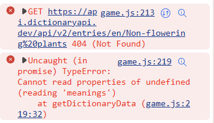

- #### Delay on topic select
    This bug depends on browser speed. When a topic is selected the function to showGamePlay is run straight away. This means that as the button is clicked, the function which checks keyword array length is called as well. Fetching the data is slower than the time it takes to check the keyword array so sometimes returned an error saying there were no words in that topic, when there were. To resolve this, I added a timeout when calling the 'showGamePlay function within the selectTopic function. 
    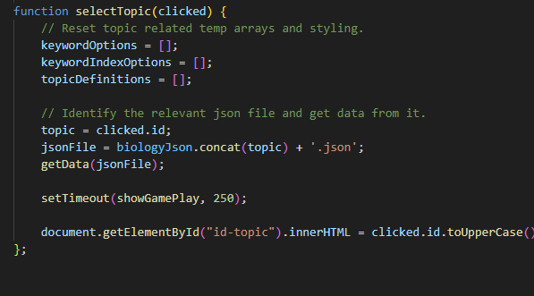

### Unresolves Bugs

- #### querySelectorAll not working with showModal method.
    I found that when I used dialog modals and added event listeners to more than one element by using 'querySelectorAll' or 'getElementByClass', an error came up saying that '.addEventListener is not a function'. This is because an array was returned when getting multiple elements. To overcome this issue I itterated through the returned array and added an event listener within the for loop. This was successful when adding an event listener to display the home screen, for example, but the exact same method returned the original error when trying to apply it to the modals. 
    I was unable to resolve this bug to the extent I would have liked, but to allow the game to continue functioning, I added event listeners onto the ID of multiple elements. This is something I intend to look into and resolve when I am not working to a deadline. 

- #### On-screen keyboard disrupts styling of game-display

## Testing

### Compatibility
Compatability Table
- #### Chrome
- #### Safari
- #### Edge
- #### Firefox

### Responsiveness
Could include videos here 
- #### Phone
- #### Tablet
- #### Desktop

### Validator Testing
- #### HTML with W3C
- #### CSS with W3C
- #### JS with JSHint?

### Accessibility and Performance
Lighthouse 

## Deployment 
Githube pages. Explain how it was deployed.

## Local Deployment
How to make a local copy by cloning

## Credits

- ### Content
    - Keywords and WJEC definitions were originally taken from [BBC Bitesize's website](https://www.bbc.co.uk/bitesize/guides/zsgfv4j/revision/1) which provides a glossary for each topic. However, midway through the project the website was updated and the glossary data was removed. Instead, I got the same data from my partner who had it provided by [pmt.education](https://www.pmt.education/?utm_source=resources&utm_medium=referral&utm_campaign=pdf&utm_content=copyright_notice) as a resource for teaching in school. 
    - I used [Free Dictionary API](https://dictionaryapi.dev/) to provide an alternative definition to aid understanding.
    - Inspiration for the project came from my partner who teaches biology in secondary school and is always looking for quick educational activities for the pupils at the start of each lesson.

- ### Media
    - #### Flower animation
        - I created the flower animation using the art package [Krita](https://krita.org/).
        - I removed the background using [removebg](https://www.remove.bg/).

    - #### All background images were taken from [unsplash](https://unsplash.com/)
        - [Home display background](https://images.unsplash.com/photo-1457369804613-52c61a468e7d?ixlib=rb-4.0.3&ixid=M3wxMjA3fDB8MHxwaG90by1wYWdlfHx8fGVufDB8fHx8fA%3D%3D&auto=format&fit=crop&w=1770&q=80)
        - [Topic display background](https://images.unsplash.com/photo-1516979187457-637abb4f9353?ixlib=rb-4.0.3&ixid=M3wxMjA3fDB8MHxwaG90by1wYWdlfHx8fGVufDB8fHx8fA==&auto=format&fit=crop&w=1770&q=80)
        - [Game display background](https://plus.unsplash.com/premium_photo-1661430659143-ffbb5ce2b6a7?ixlib=rb-4.0.3&ixid=M3wxMjA3fDB8MHxwaG90by1wYWdlfHx8fGVufDB8fHx8fA%3D%3D&auto=format&fit=crop&w=1932&q=80)    

## Acknowledgements

## Future Improvements 

- ### Potential Scope
    I aimed to create an application that has scope to grow and become more accessible to different age groups, pupils studying using different examining bodies, and different subjects. As it is currently, the project targets GCSE aged pupils studying Biology in Wales under the WJEC exam governing body.This is a very small target audience but was used to demonstrate the potential of the app in the given time frame. 

- ### Future Features 

    - #### Local leaderboard
        I would like to introduce a feature which allows the user to save their score to a leaderboard. The leaderboard would be only for 'invited' users or those in a designated 'room', with the idea being that the 'room' could contain pupils from a class. This would then allow them to share their scores with their classmates or let their teacher track their progress as they work their way throug hthe syllabus. 

    - #### Subject selection
        As mentioned in the 'Potential Scope' section, I would like this app to be expanded to include more subjects. It currently just targets Biology. The aim would be to eventualy expand the subject options to make it available to as many subjects as are suitable.

    - #### Exam body selection
        Similarly to above, I would like to widen the offering of this app to allow pupils using AQA or Edexcel, for example, for their studies. 

    - #### Increase topic offering
        The ap currently offers 6 topics in the subject of Biology, but the GCSE syllabus actually has around 20 topics which the pupils will learn in school. Due to time constraints, I didn't include all of those in this version but a future improvement would be to add the rest of the topics. 

